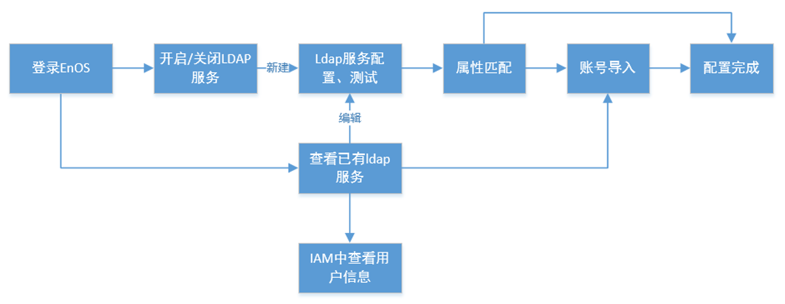

# LDAP联合快速入门

本文描述了如何从LDAP服务器导入LDAP用户并通过IAM授权LDAP用户的过程。

导入并授权LDAP用户的流程如下：

## 目标读者<audience>

   组织管理员

## 开始前准备<beforestart>

1. 确保LDAP服务器正常运行。
2. 你必须知道LDAP服务器的管理员帐户的用户名和密码。此管理员帐户应具有对所有base DN的完全的访问权限。
3. 在IAM中已创建LDAP用户的访问策略。详细信息，参考[创建和管理策略](../managing_policies)。

## 步骤1：建立与LDAP服务器的连接<connectLDAP>

1. 在EnOS控制台中选择**IAM>LDAP联合**。
2. 在点击**LDAP**页面中，点击**新建LDAP连接**，提供如下信息：

      - **域**：域是LDAP连接的唯一识别码。
      - **LDAP主服务器**：LDAP服务器IP地址或者URL。
      - **端口号**：可选，LDAP服务器的端口号。
      - **base DN**：从LDAP目录服务器导入用户时使用的根专有名称（DN）。您可以一次在一个LDAP服务器下配置多个base DN。base DN之间使用分号（;）分割。例如`cn=users,dc=example,dc=com;ou=users,dc=example,dc=com`。
      - **过滤条件**：Base DN的条件过滤字段。例如，`FILTER=memberOf=CN=group,CN=developers,DC=example,DC=com`。

        **注意**：确保所选择的条目都为有效的账号条目。
      - **User DN或用户名**：LDAP服务器的管理员帐户的用户名。
      - **密码**：LDAP服务器的管理员帐户的密码。
      - **属性匹配**：系统属性与LDAP属性之间的匹配关系。

3. 点击**测试**对LDAP连接进行测试。
      - 如果测试成功，则点击**完成**来新建LDAP连接；
      - 如果测试失败，则需要根据相应提示修改配置信息后重新提交测。

## 步骤2：开启LDAP身份验证<enableLDAP>

   完成新建LDAP连接后，在**LDAP联合**页面中，切换**LDAP认证**开启用LDAP用户登录。

## 步骤3：（可选）将LDAP用户账号同步至IAM中<importaccount>

   提前导入LDAP 账号可以帮助你对LDAP账号进行集中授权。

   执行以下步骤导入LDAP用户：

   1. 在**LDAP联合**页面中，点击需要同步的LDAP服务器后的**查看**。   

   2. 点击**同步**，将所配置的base DN下的账号信息按照设定的属性匹配规则全部导入到EnOS IAM中。   

      **Note:** IAM中已有的账号不会被再次导入。

## 步骤4：授权LDAP用户账号<authorization>

您可以单独授权LDAP用户，也可以将LDAP用户添加到授权组。

 - 已授权的LDAP用户直接登录EnOS Cloud并可访问被授权的服务。
 - 未经授权的LDAP用户在登陆后无法访问任何服务。他们需要联系组织管理员以请求权限。

授权的具体过程，参考[创建和管理用户](../managing_users)。

## 结果

  当所有配置完成，用户可通过已被导入授权的LDAP合法账号登录到EnOS控制台。
