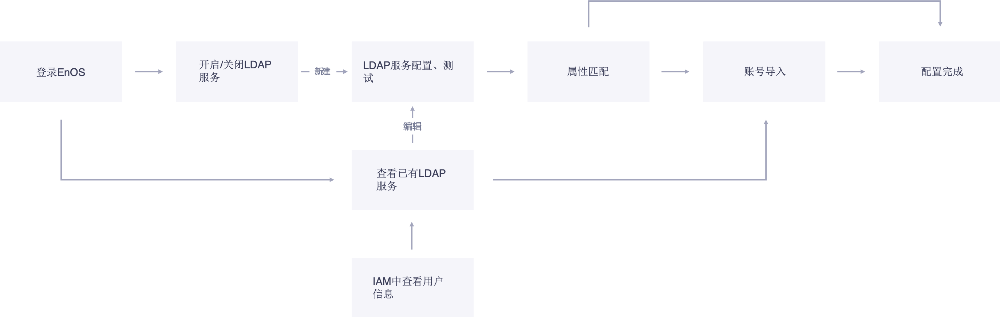

# LDAPl快速入门

该文章帮助你快速入门将LDAP服务器中的账号导入EnOS并进行权限配置。

LDAP服务配置流程如下：

## 目标读者

   管理员用户

## 开始前准备

   1.	确保需要导入的LDAP账号已在LDAP服务器中创建并且运行正常，LDAP服务器管理员账号的用户名和密码已收集。
   2.	已创建拥有LDAP管理员权限的账号。详细信息可参考 [用户管理](../managing_user.md)
   3.	LDAP用户访问策略已规划并在EnOS IAM中创建完毕。详细信息可参考 [策略管理](../managing_plicies.md)

## Step 1： 建立LDAP连接

   本步将建立LDAP连接，在EnOS IAM中配置LDAP服务器信息，把LDAP中的有效账号信息同步到EnOS IAM。

   1. 使用具有LDAP管理员权限的账号登录EnOS。点击 **访问控制>LDAP连接管理** 进入LDAP连接管理页面。

   2. 点击 **新建LDAP连接**。 进入LDAP服务器信息配置页面，在此页面中填入对应内容。

      - **域**: 域是LDAP连接的唯一识别码。
      - **LDAP主服务器**:LDAP服务器IP地址或者url。
      - **端口号**:可选，LDAP服务器的端口号。
      - **base DN**:base DN为LDAP条目唯一标识符,根据LDAP实际信息完整填入。支持单个LDAP连接下配置多个base DN，多个base DN使用分号（；）分割。举例：cn=users,dc=example,dc=com;ou=users,dc=example,dc=com。
      - **过滤条件**: Base DN的条件过滤字段。举例：FILTER=memberOf=CN=group,CN=developers,DC=example,DC=com。
      - **User DN或用户名**: LDAP服务器管理员账号的用户名，该管理员账号至少拥有该服务配置的所有base下账号的最高管理权限。
      - **密码**: LDAP服务器管理员账号的密码
      - **属性匹配**: 系统属性与LDAP属性之间的匹配关系。

   

   3. 点击 **测试** 对LDAP连接、配置信息合法性和数据获取等进行检测。
      -  如果测试成功，则点击 **完成** 来新建LDAP连接；
      -  如果测试失败，则需要根据相应提示修改配置信息后重新提交测。

## Step 2：开启LDAP登录

   新建LDAP连接完成后，在 **LDAP连接** 页面中，点击页面左上角 **LDAP认证** 启用LDAP登录功能。

## (可选) Step 3：将LDAP账号同步到EnOS IAM

   提前导入LDAP 账号可以帮助你对LDAP账号进行集中授权。
    - 被集中授权过的用户可在登录后直接访问其被授权的资源。
    - 未被授权的LDAP合法用户，初次访问EnOS时无法访问任何资源，需单独联系系统管理员获取资源访问授权才可正常使用EnOS。

   1. 在 **LDAP连接管理**，点击需要修改的LDAP域服务器后的 **查看** 进入详情页面。   

   2. 点击 **同步账号** 按钮，将所配置的base DN下的账号信息按照设定的属性匹配规则全部导入到EnOS IAM中。   

      **Note:** IAM中已有的账号不会被再次导入，且原LDAP服务器上删除的账号在IAM中会被同步删除。

## Step 4：对LDAP账号进行资源访问授权

   你可对LDAP账号进行单个授权也可通过加入用户组进行授权。

   1. 进入 **访问控制>用户管理** 页面，选择 **LDAP用户** 标签进入LDAP用户账号管理页面。  

   2. 点击需要添加授权的LDAP账号右侧的  进入账号授权页面。   

   3. 添加已建立好的访问策略，有两种方法：
      - 在 **直接授权** 标签中，点击 **添加权限策略** 为该账号添加已建立好的访问策略。   
      - 在 **加入用户组** 标签中，点击 **添加用户组** 把该账号添加到已设置访问策略的用户组中。

## 结果

  当所有配置完成，用户可通过已被导入授权的LDAP合法账号登录到EnOS中。

  **Note:** 用户首次登录时输入的LDAP域名称将通过浏览器保存到本地，下次同一用户同一个设备登录可以直接选择。
