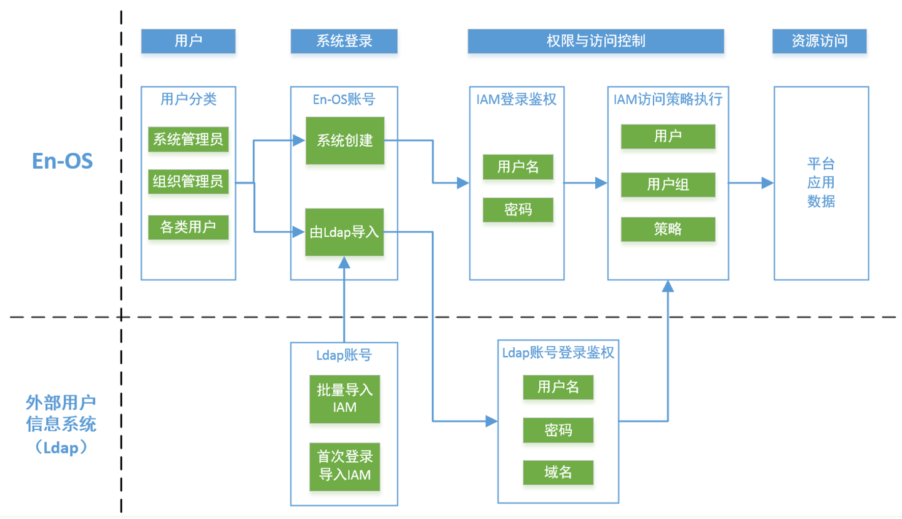

# LDAP联合概述

EnOS云端允许与轻量级目录访问协议（LDAP）联合创建用户。 支持将用户从LDAP服务器的目录中同步到EnOS用户帐户系统，并为这些LDAP用户授予权限。

你可在EnOS中管理LDAP连接，以下事实和规则适用于EnOS中的LDAP连接：

 - 一个组织可以连接到一个或多个LDAP服务器。每个LDAP连接都可以配置多个base DN帐户。
 - 多个组织可以连接到同一个LDAP服务器。
 - 确保EnOS IAM和LDAP服务器之间的用户信息一致。如果在LDAP服务器上更改了用户信息，可手动将更改同步到EnOS。每次用户登录时，EnOS都会检测该账户在LDAP服务器中的状态。

你也可以像管理内部和外部用户一样管理EnOS中的LDAP用户：

 - 可以对LDAP用户进行分组并授权。获得授权的LDAP用户可登录EnOS控制台并拥有适合的权限。
 - 可以从组织层面启用和禁用LDAP用户的登录。

## 主要概念

- LDAP连接：LDAP服务器和EnOS云端之间的连接，LDAP连接中包含了LDAP服务器的配置信息。
- LDAP用户：使用从LDAP目录导入的帐户登录EnOS云端的用户。

## LDAP用户登录流程

下图为LDAP用户登录的流程。

