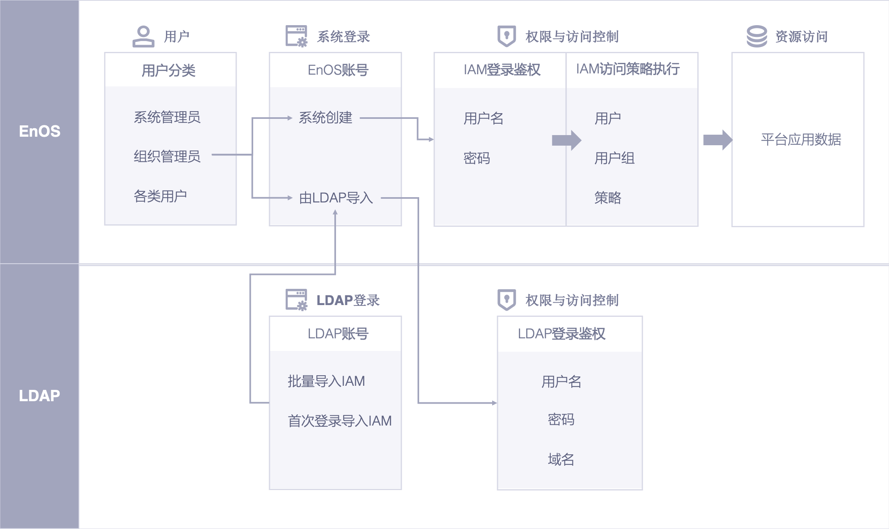

# LDAP账号登录概述

  EnOS提供了LDAP账号登录功能。你可在LDAP连接管理中把LDAP服务器上的账号同步到EnOS中，并通过EnOS IAM进行LDAP账号的资源访问权限控制。

## 主要功能

  - 管理LDAP连接

   + 同一个组织支持新建一个或多个LDAP连接，每个LDAP连接支持多个base DN所属账号的登录授权。也支持多个组织连接到同一个LDAP服务器。
   + 在LDAP连接管理页面中，你可对所在组织的LDAP账号进行管理，包括查看每一个LDAP连接的详情信息，及对已有LDAP连接进行编辑和删除操作。
   + 保持EnOS中的LDAP账号和LDAP服务器的一致性。EnOS IAM可手动同步LDAP服务器上的账号变动。并且每次用户登录时, EnOS会检测该账号在LDAP服务器的中的状态。

  - 管理在IAM中的LDAP账号
   + 你可在EnOS IAM中对LDAP账号进行分组和设置资源访问控制策略。使用LDAP账号登录EnOS的用户即会根据既定的权限访问相应的资源。
   + 你可手动开启或关闭本组织成员的LDAP账号登录服务。

## 概念
  - LDAP（轻量级目录访问协议，Lightweight Directory Access Protocol)是实现提供被称为目录服务的信息服务。用于帮助用户实现基于大量不同应用的统一身份认证和单点登录，免去多系统多账号带来的管理和使用不便。
  - LDAP连接： 组织管理员在EnOS中建立的LDAP账号登录服务连接，包含了连接LDAP服务器的配置信息。
  - LDAP用户： 使用LDAP账号登录EnOS的用户。
  - 管理员用户： 组织管理员以及被组织管理员授予LDAP管理权限的用户。
  - 普通用户： 除了管理员用户外的其他用户。

## 信息流/架构图

系统总体架构与流程示意图如下

